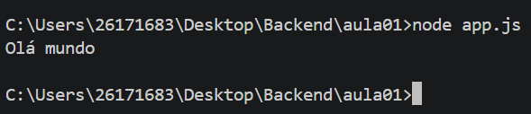

# Meu Primeiro Projeto JavaScript

## 🧑🏻‍🎓 Aluno

Nome: Yuri Saito Mena
Turma: DS1B
Professor Vitor Lima

---

## Sobre

Esse projeto desenvolvido durante a primeira aula de JavaScript.

O objetivo foi aprender:

- utilizar o VS Code;
- executar o JavaScript com Node.js;
- utilizar o Terminal;
- criar documentação utilizando Markdown.

## 🗂️Estrutura

meu-primeiro-projeto

|-app.js
|-informacoes.js
|-operacoes.js
|readme.md
|variavel.js

## Como executar

Abra o terminal e execute:

```bash
node app.js
```

```javascript
console.log("Olá, mundo");
```

## Resultado



---
## Tecnologias

- JavaScript;
- Node.js;
- Visual Studio Code;
- Markdown.
  
## O Que Aprendi

- Criar arquivos JavaScript;
- Executar programas;
- Criar README;
- Utilizar Markdown;
- Git;
- Variável;
- Operadores.